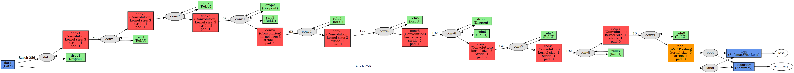
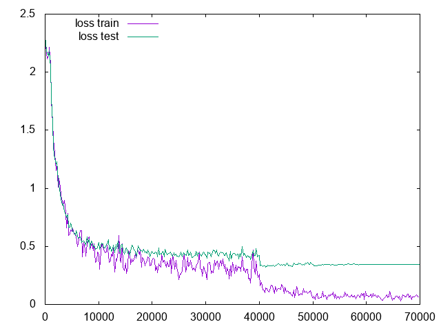
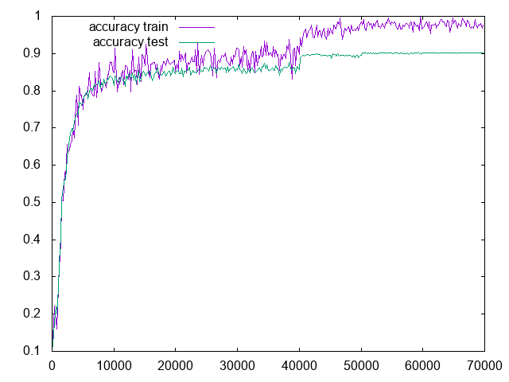

# ALL-CNN

This is the implementation of All-CNN-C model for [CIFAR-10](https://www.cs.toronto.edu/~kriz/cifar.html) from the paper [Striving for Simplicity: The All Convolutional Net](https://arxiv.org/abs/1412.6806) by Jost Tobias Springenberg, Alexey Dosovitskiy, Thomas Brox, Martin Riedmiller, accepted as a workshop contribution at ICLR 2015.



The best saved model, from iteration 52000, achieves 90.25% accuracy on the test set.
It was trained on Caffe version from commit [5a201dd960840c319cefd9fa9e2a40d2c76ddd73](https://github.com/BVLC/caffe/tree/57a5bbde4ede19c545c5932334782e3a755b2265).

## Dataset

The training was on global contrast normalized and ZCA whitened CIFAR-10 whithout any data augmentation.
Both training and test sets were created with [Pylearn2](https://github.com/lisa-lab/pylearn2) library using [make\_cifar10\_gcn\_whitened.py](https://github.com/lisa-lab/pylearn2/blob/master/pylearn2/scripts/datasets/make_cifar10_gcn_whitened.py) script that outputs `train.pkl` and `test.pkl` files.
Then transformed to LMDB database with random, unique keys ([Creating an LMDB database in Python](http://deepdish.io/2015/04/28/creating-lmdb-in-python/)).

Here are the links to download preprocessed and ready for training/testing CIFAR-10 LMDB databases:

- [cifar-10\_train\_lmdb.zip](https://drive.google.com/open?id=0B0a9KYriPdN4R29yVW50U2Nzdms) (SHA-1 checksum: e72b00259625f77fd6c4b952568dd0904b3fa75c)
- [cifar-10\_test\_lmdb.zip](https://drive.google.com/open?id=0B0a9KYriPdN4eUxScnQwZWxRQjA) (SHA-1 checksum: ebe7e7ccbf13d704c4ce4147bcadab9dd3511972)

## Training

```
caffe train -solver ALL_CNN_C_solver.prototxt -gpu all |& tee ALL_CNN_C.log
```

I found the training unstable.
You may need to run it more than once to achieve sub 10% error rate.

On NVIDIA TITAN X GPU the training took about 2.5 h.





## Testing

```
caffe test -model ALL_CNN_C_train_val.prototxt -weights ALL_CNN_C_iter_52000.caffemodel
```

